<p align="center">

</p>

## Beautiful, Professional looking Résumé in Minutes

It is often said,

> First impression is the Last impression

What it mean's for people in the modern coorporate world is that your Your next job starts with your resume. It is all the more important for you to make a good first impression and Resumify let's you do this in matter of a few minutes. No more Latex or forcefully structured word documents. We have abstracted the complicated and made it simple so that you can focus on the important.

Resumify provides you with a user-friendly dashboard, beautiful designs and real-time database syncing. With a split-section layout, you get to focus your attention to areas that need work. Everything to help you grab that next offer that comes along your way

## Themes

Resumify currently supports 12 unique design templates with more extensibility and features to come in the near future!

### 1. Class

<p align="center">
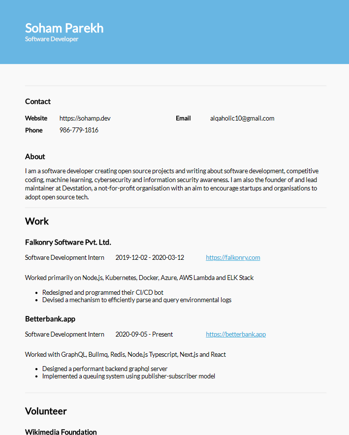
</p>

### 2. Elegant

<p align="center">

</p>

### 3. Eloquent

<p align="center">
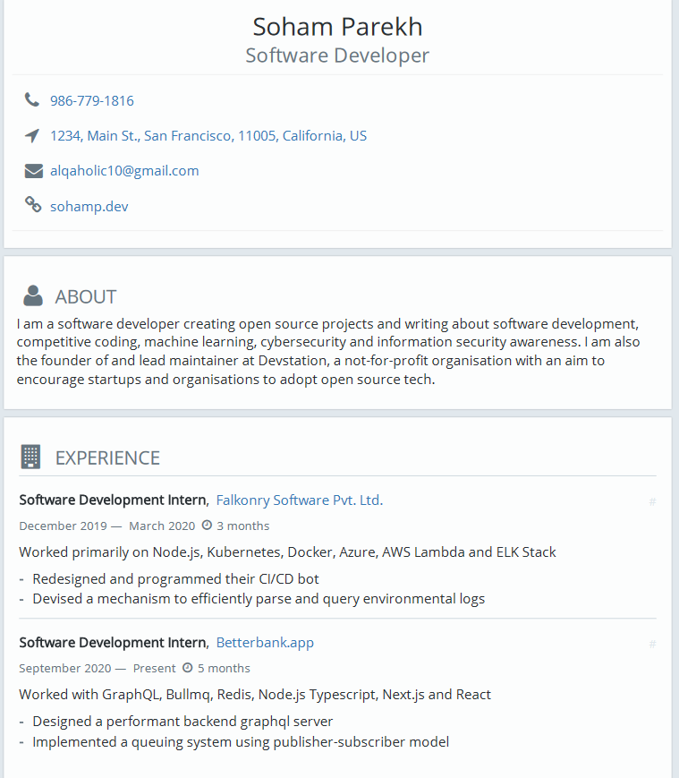
</p>

### 4. Even

<p align="center">
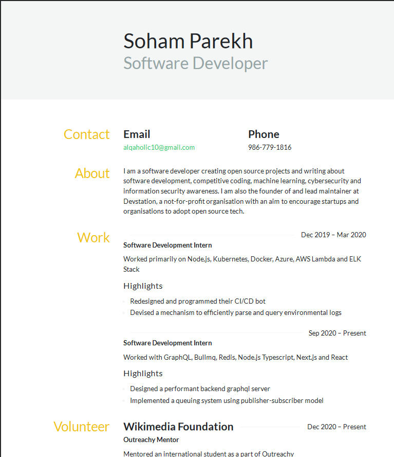
</p>

### 5. Flat

<p align="center">
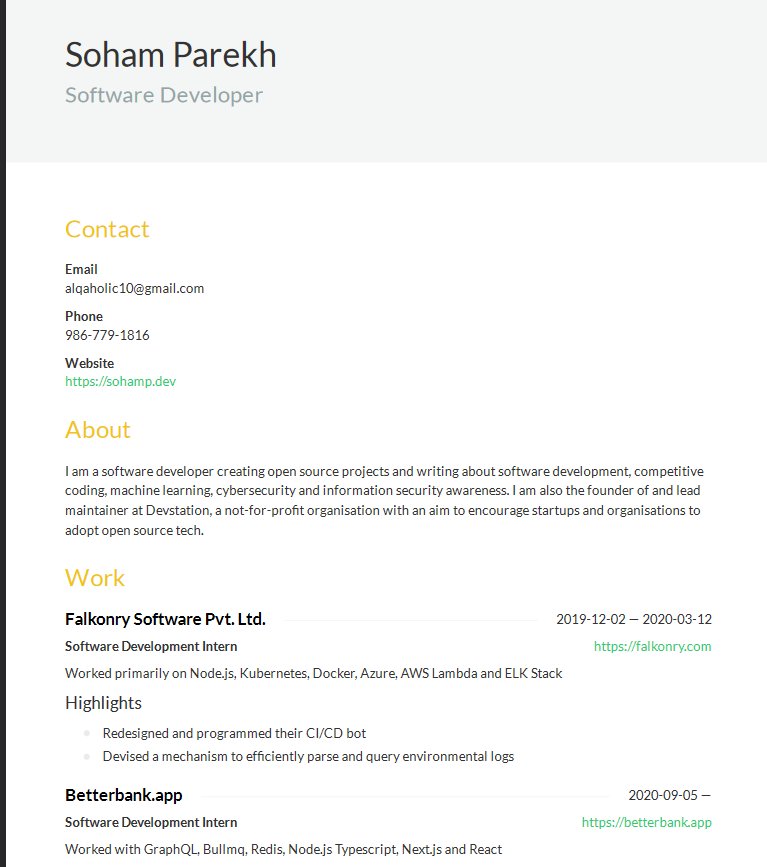
</p>

### 6. Kendall

<p align="center">
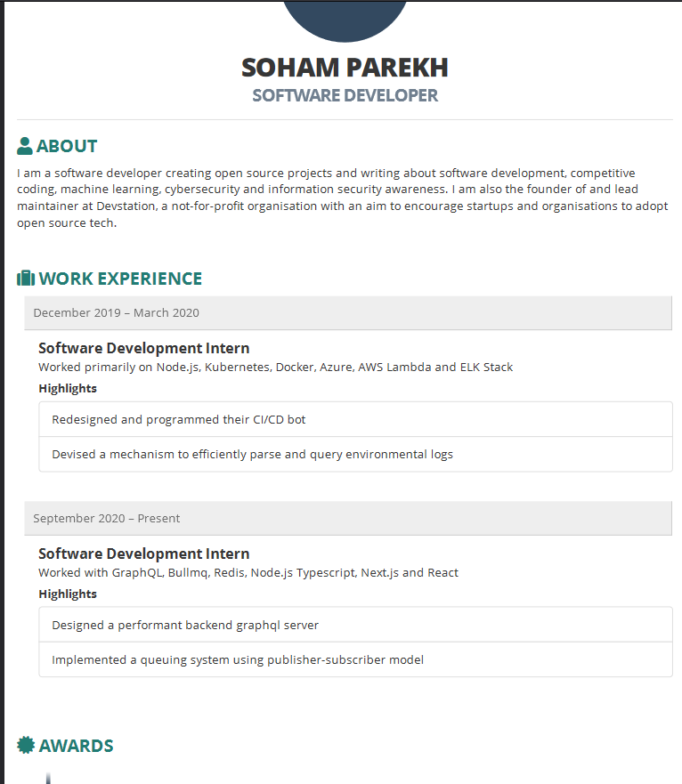
</p>

### 7. Macchiato

<p align="center">
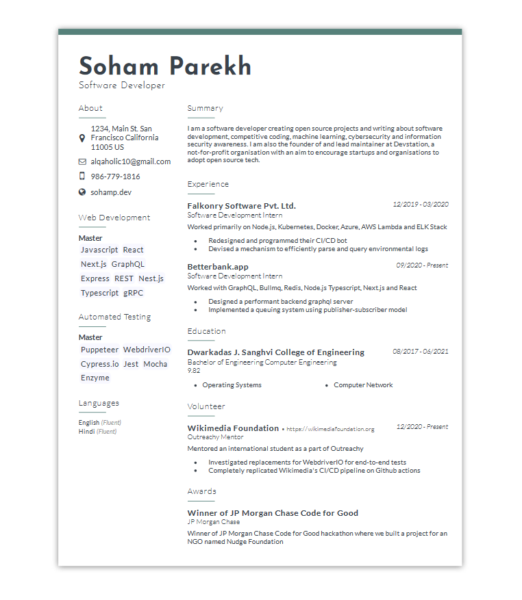
</p>

### 8. Modern

<p align="center">
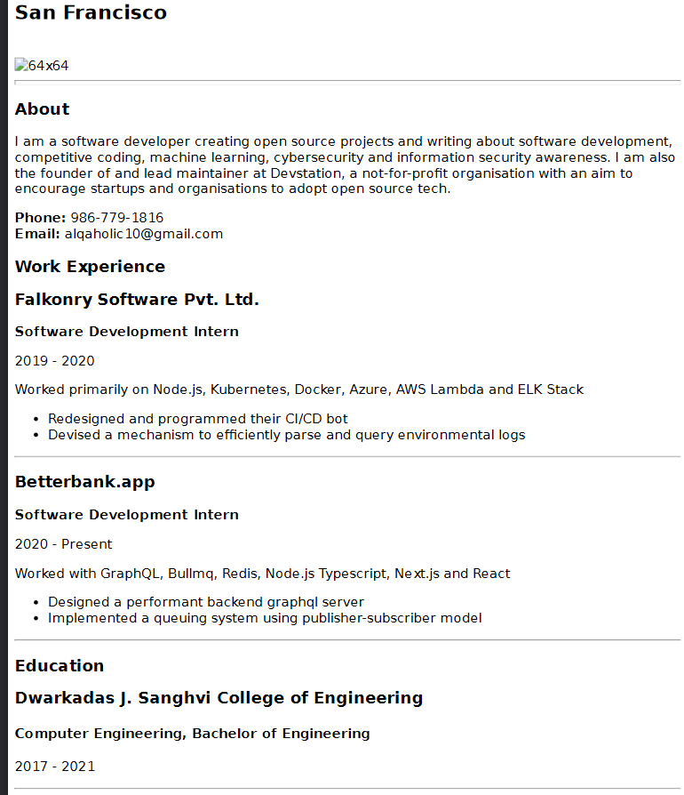
</p>

### 9. Paper

<p align="center">
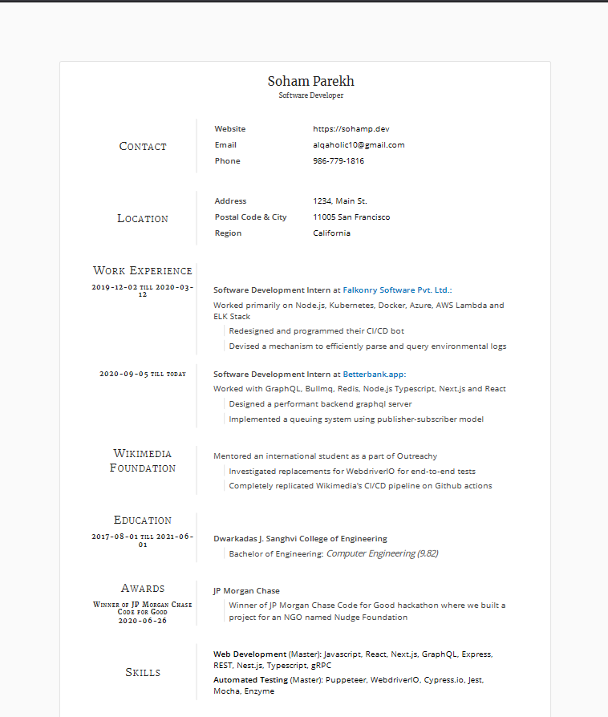
</p>

### 10. Short

<p align="center">
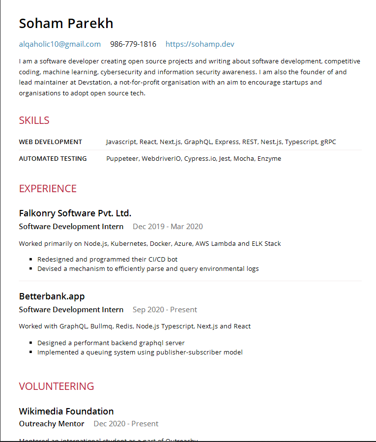
</p>

### 11. Spartan

<p align="center">
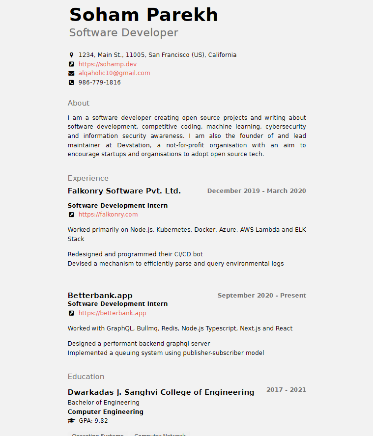
</p>

### 12. Stackoverflow

<p align="center">
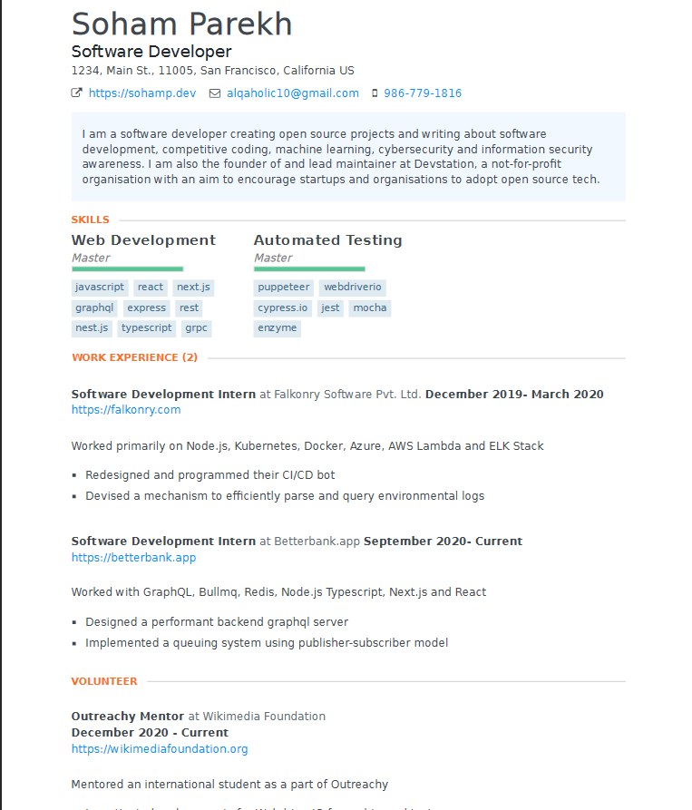
</p>

## Theme

The theme of our project idea is _Productivity_. We aim to reduce the manual effort spent in crafting the structure of an elegant resume so that you can focus on what's important...the content. The idea is to quickly bootstrap and compare resume templates or build one for your own that can serve you long way in the future.

## Technologies Used:

Open-source is what drives Resumify. This project would not have been possible without these tools and technologies:

- _Frontend:_ ReactJS, React Bootstrap
- _Backend:_ AWS Amplify, Express, Puppeteer
- _Version Control:_ Git and Github
- _IDE:_ VS Code

## Features

✔ No more Latex or complicated word document layouts  
✔ Extensible themes  
✔ Over 10+ out-of-the-box design choices  
✔ Version controlled and synced with database  
✔ Form layout for easy section management  
✔ ATS compliant headings  
✔ Live previews  
✔ Download on the fly  
✔ Easy to use even for novices  
✔ MFA Authentication so that your documents are private to just you

and a lot more...

## Future prospects

- Speech to text for aiding the impaired
- Voice-based navigation and accessibility improvements
- Plugin and active markdown support
- Drag-and-drop sections and comprehensive section management
- Dynamic sections
- Plugin support and guide to bootstrap custom themes
- Timeline/version-control

## Repository structure

This repository contains all the code to the front-end of the application. Code to the backend of the application resides [here](https://github.com/und3fined-v01d/resumify-backend). These separation of concerns essentially allow us to evolve the frontend and the backend independent of each other.

| S.No | Directory | Purpose                                                                                                               |
| ---- | --------- | --------------------------------------------------------------------------------------------------------------------- |
| 1    | .github   | Git workflows, issue templates, etc                                                                                   |
| 2    | .vscode   | VSCode configuration for this project                                                                                 |
| 3    | amplify   | This directory is auto-generated by aws-amplify and should not be touched. The GraphQL Schema definitions reside here |
| 4    | docs      | Documentation                                                                                                         |
| 5    | public    | Static assets                                                                                                         |
| 6    | src       | Front-end                                                                                                             |

## How to get started locally

1. [Install Node.js 12 or higher](https://nodejs.org/en/download/)
2. Install dependencies using `npm ci`
3. [Install AWS Amplify CLI](https://www.npmjs.com/package/@aws-amplify/cli)
4. Setup AWS Amplify project by running `amplify init`
5. Generate the GraphQL API using `amplify add api`

```
amplify add api

? Please select from one of the below mentioned services: GraphQL
? Provide API name: resumifyapi
? Choose the default authorization type for the API: AWS Cognito Pool
? Do you want to configure advanced settings for the GraphQL API: No, I am done.
? Do you have an annotated GraphQL schema?  No
? Do you want a guided schema creation?  Yes
? What best describes your project: # Select the last option
? Do you want to edit the schema now? Yes
```

6. Run the app using `npm start`

## Challenges that we ran into while creating this project

Both Sladyn and myself have seen the struggle students wanting to pursue higher education go through while drafting a compliant CV/resume, be it for academic needs or job applications. We wanted to abstract the nitty-gritty of crafting a resume and having properly-named headings to make them ATS compliant. We are proud of the solution that we have come up with however this wasn't without any struggles.

We wanted to use Lambda triggers for our GraphQL end-points and the best way to share dependencies was to create Lambda layers. However, Lambda layers support an unpacked size of 246 MB for shared dependencies. Trying Vercel's serverless did not turn out to be fruitful either since it too just provided an abstraction behind AWS Lambda.

The alternative left around for us was AWS EC2. While this initially turned out fine, serving our backend through a https was the next issue in our paths. We tried using a self-signed certificate using openssl and even tried using certbot to generate a temporary 90-day certificate so that browsers don't block the requests sent from our client to our server. This too had their own issues. Eventually however, with our persistance and will to help others, we were able to rise above all difficulties and thus Resumify materialized.

## Contributors

- Soham Parekh <@und3fined-v01d, mail@sohamp.dev>
- Sladyn Nunes <@sladyn98, sladynnunes98@gmail.com>
